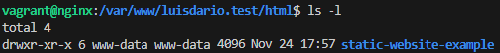
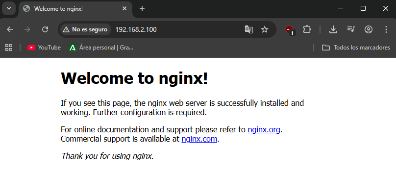
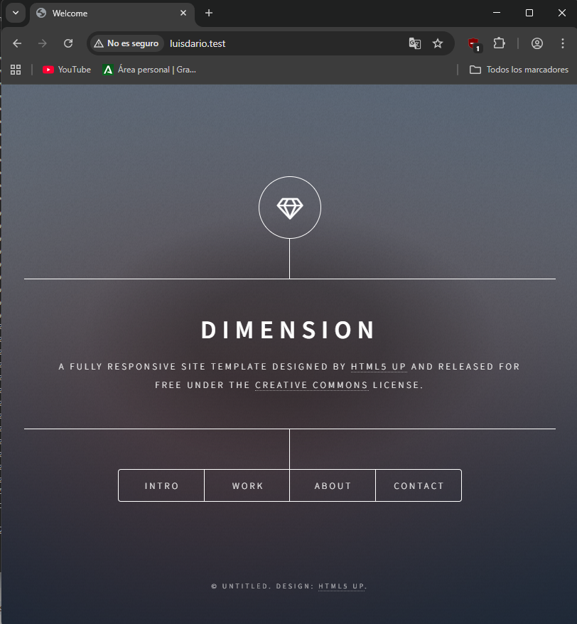
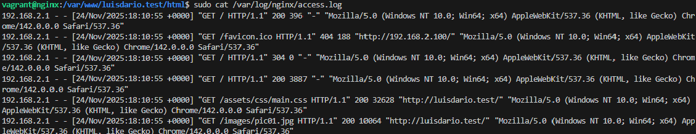

# Práctica 2.1: Instalación y configuración de servidor web Nginx

## Sumario:

1.  Instalación servidor web Nginx
2.  Creación de las carpetas del sitio web
3.  Configuración de servidor web NGINX
4.  Comprobaciones

## 1. Instalación servidor web Nginx

Vamos a empezar instalando el servidor en nuestra máquina Debian. Primero actualizamos los repositorios y después instalamos el paquete correspondiente:

```
sudo apt update
sudo apt install nginx
```

Hecho esto, vamos a comprobar que Nginx se ha instalado y que está funcionando correctamente con `systemctl status nginx`. Nos tendría que salir algo así:


## 2. Creación de las carpetas del sitio web

Igual que ocurre en Apache, todos los archivos que formarán parte de un sitio web se organizarán en carpetas dentro de `/var/www`. Vamos a crear la carpeta de nuestro dominio:

```
sudo mkdir -p /var/www/luisdario.test/html
```

Ahora vamos a entrar en esa carpeta y clonar el repositorio que usaremos de ejemplo.

```
cd /var/www/luisdario.test/html
git clone https://github.com/cloudacademy/static-website-example
```

Además, tenemos que hacer que el propietario de esta carpeta y todo lo que haya dentro sea del usuario `www-data`, que es el usuario del servicio web, y le daremos los permisos adecuados para no tener errores de acceso:

```
sudo chown -R www-data:www-data /var/www/luisdario.test/html
sudo chmod -R 755 /var/www/luisdario.test
```

Podemos comprobar con un `ls -l` que los permisos y el propietario se han aplicado correctamente:



Si ahora accedemos a la IP de nuestra máquina, veremos la página por defecto de Nginx, lo que demuestra que todo es correcto hasta ahora.



## 3. Configuración de servidor web NGINX

Para que Nginx presente el contenido de nuestra web, es necesario crear un bloque de servidor. En vez de modificar el archivo `default`, crearemos uno nuevo en la carpeta `sites-available`.

Ejecutamos `sudo nano /etc/nginx/sites-available/luisdario.test` y lo rellenamos con el siguiente contenido.

```
server {
    listen 80;
    listen [::]:80;

    root /var/www/luisdario.test/html/static-website-example;

    index index.html index.htm index.nginx-debian.html;

    server_name luisdario.test;

    location / {
        try_files $uri $uri/ =404;
    }
}
```

Ahora vamos a crear un enlace simbólico entre este archivo y la carpeta de sitios habilitados (`sites-enabled`), para que se dé de alta automáticamente.

```
sudo ln -s /etc/nginx/sites-available/luisdario.test /etc/nginx/sites-enabled/
```

Y reiniciamos el servidor para aplicar la configuración:

```
sudo systemctl restart nginx
```

## 4. Comprobaciones

Para comprobar que podemos acceder por el nombre necesitaremos un servidor DNS. Podemos ahorrarnos este paso si directamente en la configuración de los hosts del sistema operativo añadimos la dirección.

Ahora, si entramos al navegador y ponemos `http://luisdario.test`, nos debería cargar la página web que hemos clonado en lugar de la de defecto de Nginx:



Por último, vamos a comprobar que las peticiones se están registrando correctamente en los archivos de logs.

Podemos ver el registro de accesos con `sudo cat /var/log/nginx/access.log`:


