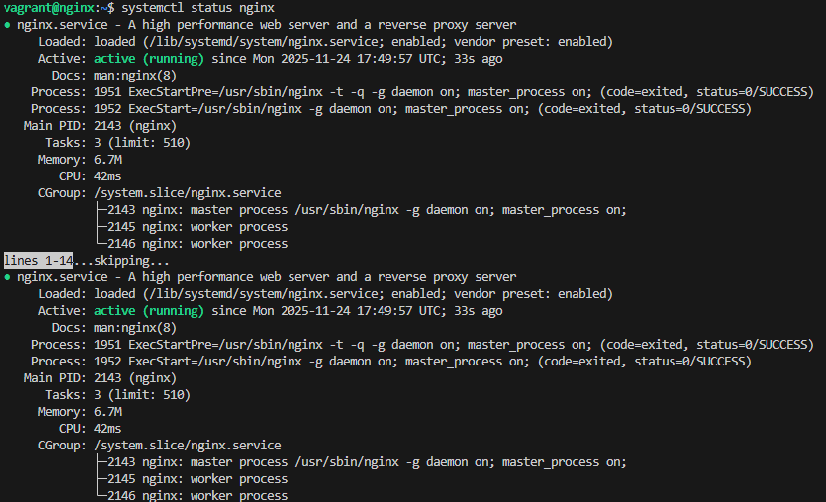

# Práctica 2.1: Instalación y configuración de servidor web Nginx

## Sumario:

1.  Instalación servidor web Nginx
2.  Creación de las carpetas del sitio web
3.  Configuración de servidor web NGINX
4.  Comprobaciones

## 1. Instalación servidor web Nginx

Vamos a empezar instalando el servidor en nuestra máquina Debian. Primero actualizamos los repositorios y después instalamos el paquete correspondiente:

```
sudo apt update
sudo apt install nginx
```

Hecho esto, vamos a comprobar que Nginx se ha instalado y que está funcionando correctamente con `systemctl status nginx`. Nos tendría que salir algo así:


